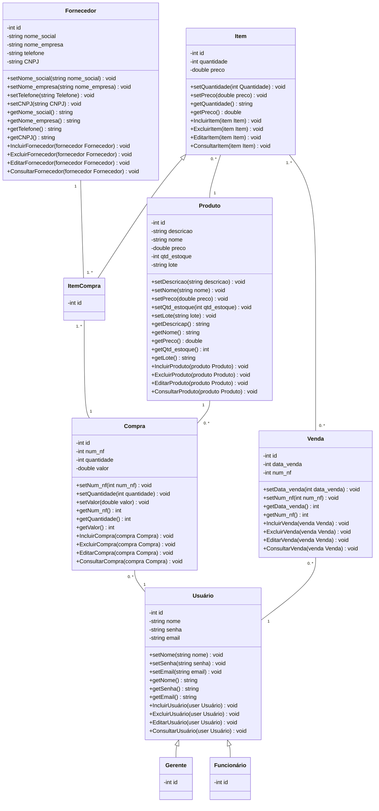

# Contagem de Pontos de Função

A contagem de Pontos de Função (PF) permite a determinação do Tamanho Funcional do projeto de software. A análise de ponto de função (APF) é um processo para a identificação e contagem das funcionalidades baseadas nos conceitos de Funções de Dados e Funções de Transação.

Os conceitos relacionados com dados são os Arquivos de Lógica Interna (ALI) e os Arquivos de Interface Externa (AIE), e os conceitos relacionados com operações externas à fronteira do sistema são: Entrada Externa (EE), Consulta Externa (CE) e Saída Externa (SE).

Existem várias práticas de contagem, cada uma com suas especificidades.

## Contagem Indicativa (Ci)

Na contagem indicativa (Ci), só é necessário conhecer e analisar as Funções de Dados. Desta forma, os ALIs (Arquivos Lógicos Internos) têm o valor de 35 PF cada e os AIEs (Arquivos de Interface Externa) têm o valor de 15 PF cada.

### Diagrama de classes

### Contagem Indicativa

| **Função de Dado**   | **Entidades Relacionadas**    | **Tamanho em PF** |
|----------------------|-------------------------------|:-----------------:|
| ALI Usuário          | Usuário e Grupo               | 35 PF             |
| ALI Compra           | Compra e ItemCompra           | 35 PF             |
| ALI Venda            | Venda e Item                  | 35 PF             |
| ALI Fornecedor       | Fornecedor                    | 35 PF             |
| ALI Produto          | Produto                       | 35 PF             |
| ALI Item             | Item                          | 35 PF             |
| **Total**            | **Ci**                        | **185 PF**        |

## Contagem Detalhada (Cd)

Para a contagem detalhada, calculamos os Pontos de Função com base nas Funções de Transação e nos Arquivos de Dados, considerando o número de Referências Lógicas Internas (RLR), Referências de Dados Externos (DER) e a complexidade.

### Contagem Detalhada

| **Descrição**        | **Tipo** | **ALR** | **DER** | **Complexidade** | **Tamanho em PF** |
|----------------------|----------|---------|---------|------------------|:-----------------:|
| ALI Usuário          | ALI      | 2       | 11      | Baixa            | 7 PF              |
| ALI Compra           | ALI      | 2       | 12      | Média            | 10 PF             |
| ALI Venda            | ALI      | 2       | 12      | Média            | 10 PF             |
| ALI Fornecedor       | ALI      | 2       | 12      | Média            | 10 PF             |
| ALI Produto          | ALI      | 2       | 12      | Média            | 10 PF             |
| ALI Item             | ALI      | 2       | 12      | Baixa            | 7 PF              |
| Inserir Usuário      | EE       | 3       | 9       | Média            | 4 PF              |
| Atualizar Usuário    | EE       | 3       | 9       | Média            | 4 PF              |
| Consultar Usuário    | CE       | 3       | 9       | Média            | 4 PF              |
| Detalhar Usuário     | CE       | 3       | 9       | Média            | 4 PF              |
| Inserir Compra       | EE       | 2       | 10      | Média            | 5 PF              |
| Atualizar Compra     | EE       | 2       | 10      | Média            | 5 PF              |
| Consultar Compra     | CE       | 2       | 10      | Média            | 5 PF              |
| Detalhar Compra      | CE       | 2       | 10      | Média            | 5 PF              |
| Inserir Venda        | EE       | 2       | 10      | Média            | 5 PF              |
| Atualizar Venda      | EE       | 2       | 10      | Média            | 5 PF              |
| Consultar Venda      | CE       | 2       | 10      | Média            | 5 PF              |
| Detalhar Venda       | CE       | 2       | 10      | Média            | 5 PF              |
| Inserir Fornecedor   | EE       | 2       | 10      | Média            | 5 PF              |
| Atualizar Fornecedor | EE       | 2       | 10      | Média            | 5 PF              |
| Consultar Fornecedor | CE       | 2       | 10      | Média            | 5 PF              |
| Detalhar Fornecedor  | CE       | 2       | 10      | Média            | 5 PF              |
| Inserir Produto      | EE       | 2       | 10      | Média            | 5 PF              |
| Atualizar Produto    | EE       | 2       | 10      | Média            | 5 PF              |
| Consultar Produto    | CE       | 2       | 10      | Média            | 5 PF              |
| Detalhar Produto     | CE       | 2       | 10      | Média            | 5 PF              |
| **Total**            |          |         |         | **Cd**           | **144 PF**        |

## Resumo Final

**Contagem Indicativa (Ci):** 185 PF  
**Contagem Detalhada (Cd):** 144 PF

A contagem indicativa fornece uma estimativa baseada nas entidades e suas relações, enquanto a contagem detalhada considera a complexidade das transações e operações no sistema.
