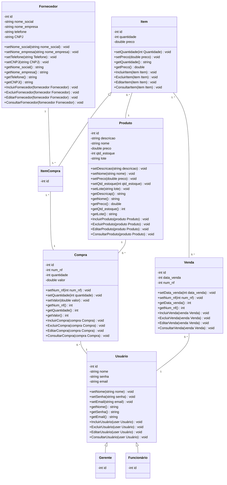

# Documento de Modelos

Neste documento temos o modelo Conceitual (UML) ou de Dados (Entidade-Relacionamento). Temos também a descrição das entidades e o dicionário de dados.

## Modelo Conceitual

### Diagrama de Classes usando Mermaid

### Descrição das Entidades

Descrição sucinta das entidades presentes no sistema.

| Entidade | Descrição   |
|----------|------------------------------------------------------------------------------------------------------------------------------------------------------|
| Usuário   | Entidade que representa um usuário tem como atributos: id, nome, senha e email e seus métodos são: setNome(nome) , setSenha(senha), setEmail(email), getNome(), getSenha(), getEmail(), IncluirUsuário(user Usuário), ExcluirUsuário(user Usuário), EditarUsuário(user Usuário), ConsultarUsuário(user Usuário). |
| Funcionário | Entidade que representa um funcionário herdando a entidade usuário. |
| Gerente | Entidade que representa um gerente herdando a entidade usuário. |
| Compra | Entidade que representa uma compra com os seguintes atributos: id, num_nf, quantidade, valor, e seus métodos são: setNum_nf(num_nf), setQuantidade(quantidade), setValor(valor), getNum_nf(), getQuantidade(), getValor(), IncluirCompra(compra Compra), ExcluirCompra(compra Compra), EditarCompra(compra Compra), ConsultarCompra(compra Compra). |
| Fornecedor | Entidade que representa um fornecedor com os seguintes atributos: id, nome_social, nome_empresa, telefone, CNPJ, e seus métodos são: setNome_social(nome_social), setNome_empresa(nome_empresa), setTelefone(telefone), setCNPJ(CNPJ), getNome_social(), getNome_empresa(), getTelefone(), getCNPJ(), IncluirFornecedor(fornecedor Fornecedor), ExcluirFornecedor(fornecedor Fornecedor), EditarFornecedor(fornecedor Fornecedor), ConsultarFornecedor(fornecedor Fornecedor). |
| Produto | Entidade que representa um produto com os seguintes atributos: id, descricao, nome, preco, qtd_estoque, e seus métodos são: setDescricao(descricao), setNome(nome), setPreco(preco), setQtd_estoque(qtd_estoque), getDescricao(), getNome(), getPreco(), getQtd_estoque(), IncluirProduto(produto Produto), ExcluirProduto(produto Produto), EditarProduto(produto Produto), ConsultarProduto(produto Produto). |
| Item | Entidade que representa um item com os seguintes atributos: id, quantidade, preco, e seus métodos são: setQuantidade(quantidade), setPreco(preco), getQuantidade(), getPreco(), IncluirItem(item Item), ExcluirItem(item Item), EditarItem(item Item), ConsultarItem(item Item). |
| Venda | Entidade que representa uma venda com os seguintes atributos: id, data_venda, num_nf, e seus métodos são: setData_venda(data_venda), setNum_nf(num_nf), getData_venda(), getNum_nf(), IncluirVenda(venda Venda), ExcluirVenda(venda Venda), EditarVenda(venda Venda), ConsultarVenda(venda Venda). |